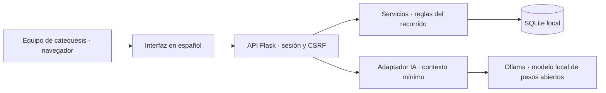

# Arquitectura y decisiones

El recorrido se guarda en tablas normalizadas. Las transiciones validan los requisitos dentro de una transacción de escritura y comparan la etapa esperada para evitar avances duplicados por reenvío. Las correcciones de asistencia mantienen el estado actual en `attendance` y dejan eventos adicionales. No hay endpoints para borrar eventos: no implica inmutabilidad frente al dueño del archivo SQLite.

SQLite con claves foráneas, WAL y conexiones por solicitud simplifica la operación local. El esquema inicial tiene versión 1 y la migración `002_plans.sql` añade propuestas de acompañamiento en la versión 2; la migración `003_groups.sql` añade períodos, grupos, inscripciones, responsables, asociación de asistencia y revisión humana (versión 3) dentro de una transacción; futuras modificaciones requieren una migración nueva y validación de restauración, no cambios destructivos al script inicial. La API actual carga las fichas e historiales completos; paginación y consultas de resumen son trabajo previo a un volumen grande.

El acceso usa un código aleatorio privado persistido con permisos 0600, cookie HttpOnly/SameSite Strict, token CSRF, lista de hosts y sesión de ocho horas. El proceso se enlaza solamente a loopback. No hay usuarios individuales ni límite de intentos; no es un servicio listo para internet.

La IA no tiene herramientas de escritura. Un contexto numérico evita introducir datos identificadores o instrucciones en texto libre en el modelo. Resume información registrada; el equipo de catequesis toma las decisiones. Las propuestas se guardan con una copia del contexto y se marcan como desactualizadas si el progreso cambia. La salida JSON se valida antes de guardar; una respuesta mal formada produce un error y no inserta una propuesta. Esa validación no demuestra corrección semántica: el equipo de catequesis revisa el texto.

## Fuentes

- [Fábrica de aplicaciones de Flask](https://flask.palletsprojects.com/en/stable/patterns/appfactories/): configuración separada y creación de aplicaciones para pruebas.
- [SQLite en Flask](https://flask.palletsprojects.com/en/stable/tutorial/database/): conexión por solicitud y cierre al terminar el contexto.
- [API de chat de Ollama](https://docs.ollama.com/api/chat): inferencia local no transmitida en streaming.
- [Rishu: FlyCNS-TicTacToe](https://dev.to/asyncinnovator/i-connected-a-fruit-fly-connectome-to-tic-tac-toe-with-a-minimax-safety-net-5bc0): ejemplo de separar una propuesta de un componente experimental de una regla determinista que limita su acción. Es una analogía de diseño, no evidencia específica sobre catequesis. En los comentarios se cuestionan determinismo y sesgos; aquí las transiciones dependen de requisitos explícitos, nunca del resumen generado.

La búsqueda semántica de DevRelay devolvió pocos resultados relevantes para Flask/SQLite; no se infiere un consenso arquitectónico de esos resultados.

## Contexto comunitario para la salida estructurada

- [DevShakib: Structured Output From LLMs](https://dev.to/devshakib/structured-output-from-llms-a-retry-repair-loop-your-parser-never-sees-through-3b0b): defensa por capas y validación propia aun al usar salida estructurada. Se aplicaron esquema en Ollama y validación local; no se implementó su bucle de reparación.
- [Mukunda Katta: Rule-Based LLM Output Validation](https://dev.to/mukundakatta/rule-based-llm-output-validation-reject-bad-responses-before-they-reach-your-users-if0): diferencia entre estructura válida y corrección factual. Aquí no se afirma que un JSON válido sea un consejo correcto.

Ambos artículos se leyeron con DevRelay. No tenían comentarios al consultarlos; son dos referencias, no un consenso de la comunidad.

El generador final usa `enum` para acciones y preguntas: el modelo selecciona y prioriza dentro de un catálogo revisado. La primera prueba de redacción libre produjo referencias no sustentadas a clases y una pregunta con perspectiva incorrecta; por eso se restringió la salida. Se validan pertenencia al catálogo y ausencia de acciones duplicadas. El modelo puede elegir prioridades poco útiles incluso dentro de ese catálogo; el equipo de catequesis las revisa. No se oculta una lista determinista detrás de una generación simulada: una propuesta solo se guarda después de una respuesta real válida de Ollama.

## Ampliación de la versión funcional

`periods → groups → enrollments → children` conserva las inscripciones sin duplicar la ficha. `guardians` admite varios responsables; los campos originales se mantienen compatibles con clientes anteriores. Las clases conservan su clave participante/fecha y pueden asociarse a una inscripción validada. Las tablas y respaldo anteriores permanecen disponibles.

La migración 3 copia al responsable previo y conserva asistencias sin grupo. Las pruebas recorren bases de versiones 1 y 2 y reinicialización idempotente. La inscripción inicial y creación de responsables están en la misma transacción: un grupo inválido revierte la ficha completa.

Las propuestas tienen `reviewed_at`. La API comprueba que pertenezcan al participante y estén vigentes, y la revisión repetida no duplica eventos. Antes de guardar una inferencia, se vuelve a comprobar el estado en una transacción para rechazar un contexto que cambió mientras el modelo respondía.

Referencias consultadas en esta ampliación:

- [Salida estructurada oficial de Ollama](https://docs.ollama.com/capabilities/structured-outputs): JSON Schema en `format` y validación posterior. Se conservó un esquema pequeño y catálogo propio.
- [Jangwook Kim: Ollama Structured Outputs in Practice](https://dev.to/jangwook_kim_e31e7291ad98/ollama-structured-outputs-in-practice-getting-type-safe-json-from-local-llms-with-pydantic-m38): experiencia práctica con esquemas y límites de modelos pequeños; sin comentarios al consultar. No se extrapolan sus tiempos al equipo de la capilla.
- [Jonathan: Your Local LLM Is Not as Private as You Think](https://dev.to/jfisher4002/your-local-llm-is-not-as-private-as-you-think-3ek7): operar localmente no elimina los riesgos del servidor y cargador de modelos. Sus comentarios refuerzan la diferencia entre loopback y un servicio compartido. Se conserva el enlace solo a loopback y se minimiza el contexto; no se declara una auditoría de Ollama.

Son dos experiencias consultadas, no una muestra suficiente para inferir consenso.
